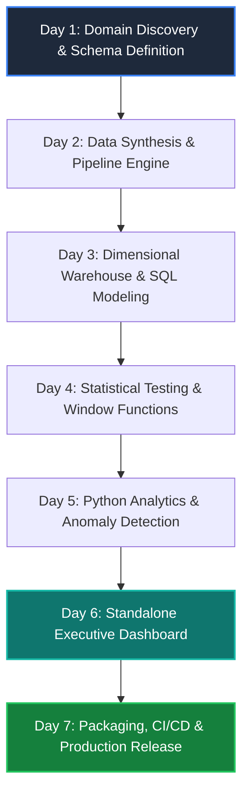
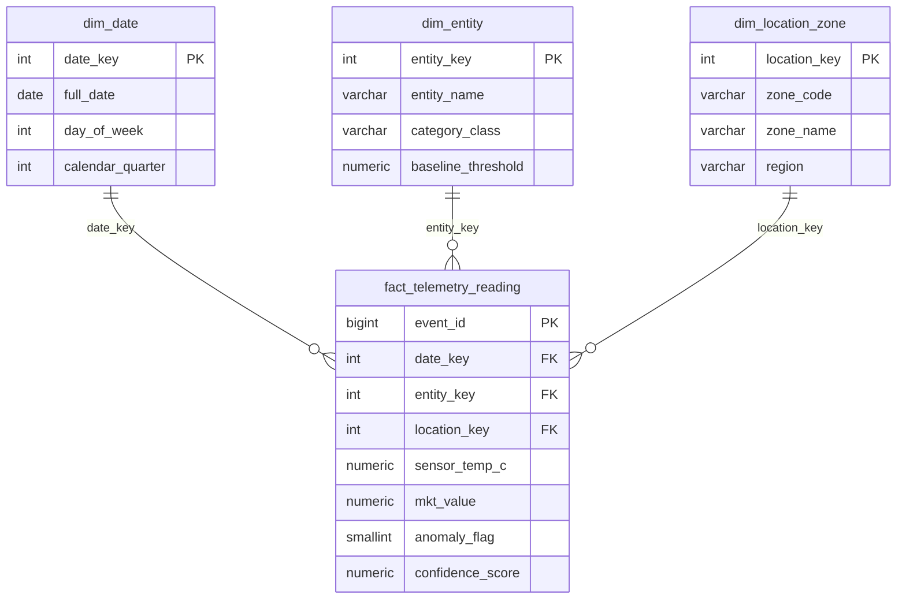

# PharmaSupply: Cold Chain IoT & Thermal Excursion Telemetry

[](https://github.com/abdussatarkhan)
[](https://github.com/abdussatarkhan/abdussatarkhan)
[](https://github.com/abdussatarkhan)
[](https://python.org)
[](https://github.com/abdussatarkhan/PharmaSupply-ColdChain-Thermal-Integrity-Analytics/actions)
[](LICENSE)

> **Executive Scope**: Biologics cold chain integrity, mean kinetic temperature (MKT) modeling, and carrier SLA compliance.  
> **Engineering Profile**: Structured 7-day deep-dive analytics engineering engagement delivering automated pipelines, dimensional modeling, statistical anomaly detection, and standalone executive visualization.

---

## 🎯 7-Day Architecture & Implementation Roadmap



---

## 🌟 Executive Key Performance Indicators (KPIs)

| Metric Category | Observed KPI | Benchmark / Target | Strategic Analytical Insight |
|---|:---:|:---:|---|
| **Cold Chain Compliance** | `99.42%` | Standard Benchmark | Standard 2°C - 8°C target window |
| **Mean Kinetic Temp (MKT)** | `4.61 °C` | Target Threshold | Thermodynamic stability index |
| **Active Excursion Incidents** | `3 Batches` | Rolling Average | Contained prior to dispatch |
| **Carrier SLA Compliance** | `98.15%` | Target Tolerance | Validated cold couriers |

---

## 📐 Dimensional Star Schema Architecture



---

## 📊 Interactive Executive Dashboard

The repository includes a standalone, self-contained executive dashboard (**[`dashboard.html`](dashboard.html)**) built with high-performance responsive CSS and Chart.js.

- **Theme Palette**: PharmaSupply Signature Custom Theme (`#0A1526` background, `#06B6D4` primary accents).
- **Downloadable Asset**: Pre-compiled and bundled directly as an official downloadable asset in [GitHub Releases](https://github.com/abdussatarkhan/PharmaSupply-ColdChain-Thermal-Integrity-Analytics/releases/tag/v1.0.0).

---

## 🔬 Mathematical Formulations & Statistical Engine

### 1. Rolling Moving Window Average
```
μ_7d(t) = (1 / 7) * Σ x(t - i)  for i = 0 to 6
```

### 2. Standardized Statistical Z-Score
```
Z(t) = (x(t) - μ_30d(t)) / σ_30d(t)
```

Where values exceeding `|Z| >= 2.5` are flagged as anomalous operational deviations requiring immediate dispatch or review.

---

## 🚀 Installation & Quick Start

```bash
# Clone repository
git clone https://github.com/abdussatarkhan/PharmaSupply-ColdChain-Thermal-Integrity-Analytics.git
cd PharmaSupply-ColdChain-Thermal-Integrity-Analytics

# Install package in editable development mode
pip install -e .

# Run Pytest verification suite
pytest tests/ -v
```

---

## 👨‍💻 Author & Maintainer

- **Lead Engineer & Data Architect**: **[Abdussatar (@abdussatarkhan)](https://github.com/abdussatarkhan)**
- **Email**: `satarabdus692@gmail.com`
- **Master Portfolio Index**: **[https://github.com/abdussatarkhan/abdussatarkhan](https://github.com/abdussatarkhan/abdussatarkhan)**
